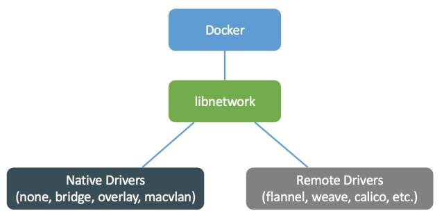

Docker跨主机网络方案包括：

- docker 原生的 overlay 和 macvlan。
- 第三方方案：常用的包括 flannel、weave 和 calico。



#### 创建 overlay 网络

```
docker network create -d overlay ov_net2
docker network create -d overlay ov_net3 --subnet 172.19.0.0/24 --gateway 172.19.0.1
```

#### 查看 netwrok 状态

```
[root@manager-1 ~]# docker network ls
NETWORK ID          NAME                 DRIVER              SCOPE
cc5cd5eabb87        bridge               bridge              local
df4c96226ccf        docker_gwbridge      bridge              local
ff0595086328        host                 host                local
ied7pqtp3pvq        ingress              overlay             swarm
z4ehwcl51qws        mysqlcluster         overlay             swarm
d7d2a11f55e2        nexus_default        bridge              local
4e3fbf78688a        none                 null                local
7b4a0049c446        visualizer_default   bridge              local
```
