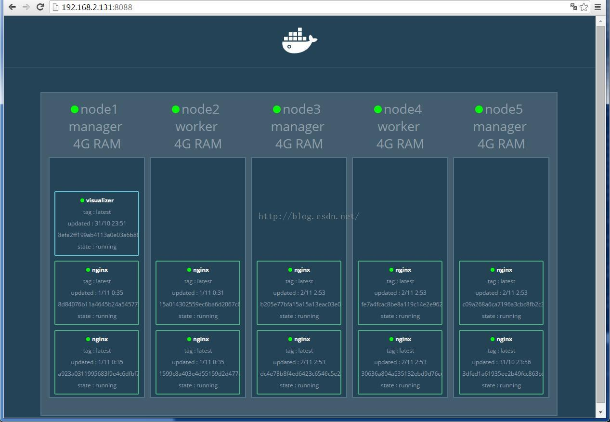

Visualizer非常直观地显示了Swarm集群中，各个Docker主机上的容器负载情况，

#### visualizer

在管理节点上运行以下服务

```
version: "3"
services:
  swarm_visualizer:
    image: dockersamples/visualizer
    ports:
      - 18090:8080
    volumes:
      - /var/run/docker.sock:/var/run/docker.sock
```



http://133.195.235.81:18090/
